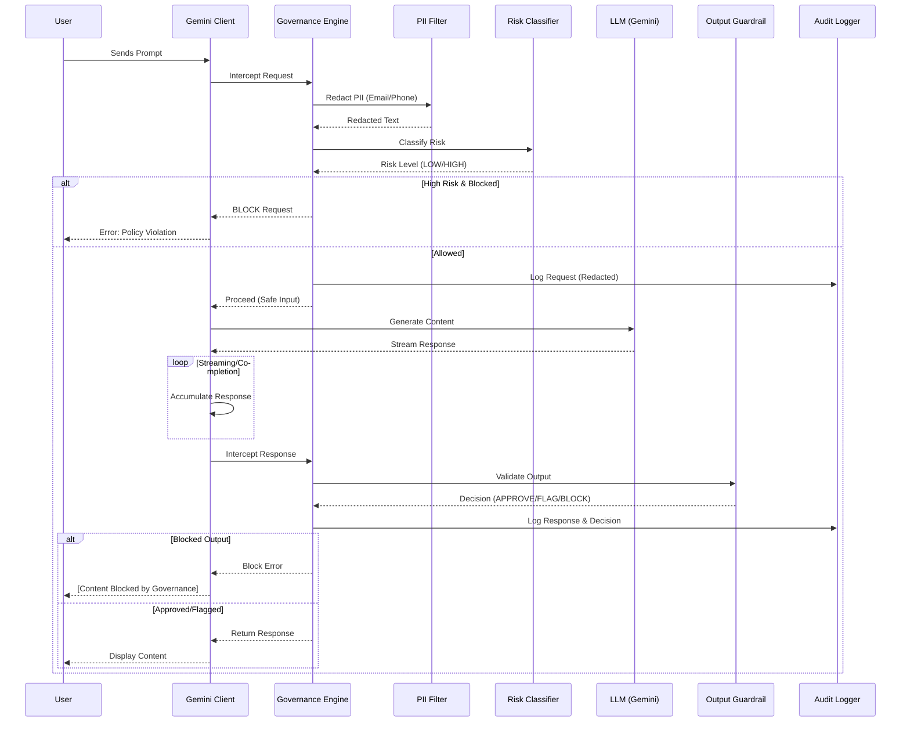

# AI Governance Layer Documentation

This module provides the **AI Governance Layer** for the Gemini CLI, designed to facilitate compliance with **ISO/IEC 42001** (Artificial Intelligence Management Systems) and the **EU AI Act** (prEN 18286).

It acts as a mandatory middleware that intercepts all LLM interactions to enforce safety, privacy, and traceability policies.

## Architecture & Flow

The following diagram illustrates how every prompt and response is processed by the governance engine:



## How Governance is Achieved

### 1. Privacy & Data Protection (ISO 42001 A.8)
*   **Mechanism**: `PIIFilter`
*   **Function**: Scans all user inputs for regex-based PII patterns (e.g., Email, Phone numbers) before the data leaves the local environment or is logged.
*   **Compliance**: Ensures that sensitive personal data is redacted in the permanent audit trail (`inputRedacted` field).

### 2. Risk Management (ISO 42001 8.2)
*   **Mechanism**: `RiskClassifier`
*   **Function**: Evaluates the intent of the prompt against predefined high-risk categories (e.g., "HR Decision", "Financial Advice").
*   **Compliance**: Assigns a `RiskLevel` to every transaction, allowing for differential policy enforcement (e.g., blocking high-risk automated decisions).

### 3. Traceability & Record Keeping (ISO 42001 A.10)
*   **Mechanism**: `AuditLogger`
*   **Function**: Creates a tamper-proof, time-stamped record of every transaction.
*   **Storage**: Logs are stored locally at `~/.gemini/governance_logs/audit_trail.jsonl` (JSON Lines format).
*   **Data Points**:
    *   Timestamp & User ID
    *   Request ID & Model Version
    *   Risk Classification
    *   Redacted Input
    *   Guardrail Decision & Justification

### 4. Output Safety (EU AI Act)
*   **Mechanism**: `OutputGuardrail`
*   **Function**: Post-generation scan of the model's output.
*   **Compliance**: Checks for leaked PII or policy violations in the generated content. For High-Risk queries, it can flag output for human review.

## Evidence Gathering

To demonstrate compliance during an audit (e.g., for ISO 42001 certification), the **Audit Trail** is your primary evidence artifact.

### Accessing Logs
Logs are located in your home directory:
```bash
cat ~/.gemini/governance_logs/audit_trail.jsonl
```

### analyzing Evidence
You can use standard tools (like `jq`) to extract evidence:

**1. Prove PII was redacted:**
```bash
grep "PII Redacted" ~/.gemini/governance_logs/audit_trail.jsonl | jq '.justification, .inputRedacted'
```

**2. List all High-Risk interactions:**
```bash
grep "HIGH" ~/.gemini/governance_logs/audit_trail.jsonl | jq '.timestamp, .riskCategory'
```

**3. Verify Model Versioning:**
```bash
jq '.modelVersion' ~/.gemini/governance_logs/audit_trail.jsonl
```

## Suggestive Actions for Enterprise Governance Teams

To fully leverage this layer for enterprise safety, we recommend the following actions:

### 1. Customize Traces & Trackability
*   **Action**: Integrate with OpenTelemetry or a centralized SIEM (Security Information and Event Management) system.
*   **Implementation**: Modify `packages/core/src/governance/AuditLogger.ts` to send logs to an HTTP endpoint (e.g., Splunk, Datadog) in addition to the local file. This ensures logs cannot be deleted by the local user.

### 2. Enforce Strict PII Usage
*   **Action**: Expand the `PIIFilter` regex patterns to match your organization's specific data formats (e.g., Employee IDs, Credit Card numbers, Internal Project Codewords).
*   **Implementation**: Update the regex definitions in `packages/core/src/governance/PIIFilter.ts`. Consider using a specialized DLP (Data Loss Prevention) library/API if regex is insufficient.

### 3. Human-in-the-Loop (HITL) Workflow
*   **Action**: For "High Risk" outputs that are `FLAGGED_FOR_REVIEW`, implement a workflow where the CLI forces a pause or requires a secondary approval step.
*   **Implementation**: Enhance `GovernanceEngine.ts` to return a specific status code that the CLI UI handles by prompting the user: *"This output is classified as High Risk. Do you confirm you have reviewed it? [y/N]"* before displaying the full content.

### 4. Periodic Risk Assessment
*   **Action**: Run the provided `scripts/risk_assessment.sh` tool quarterly.
*   **Implementation**: Use the output of the script to verify that the governance layer is active and that configurations match your internal AI policy.
